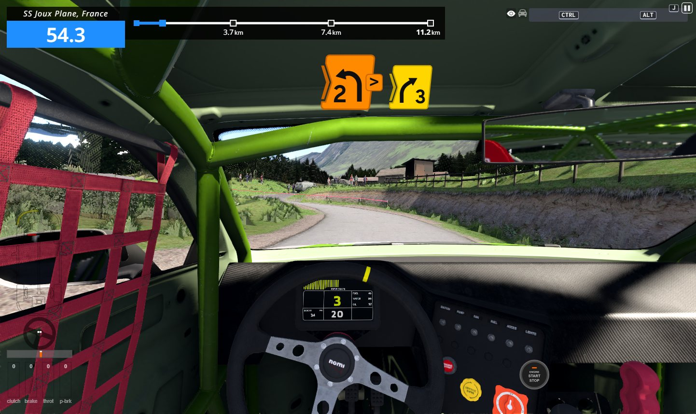
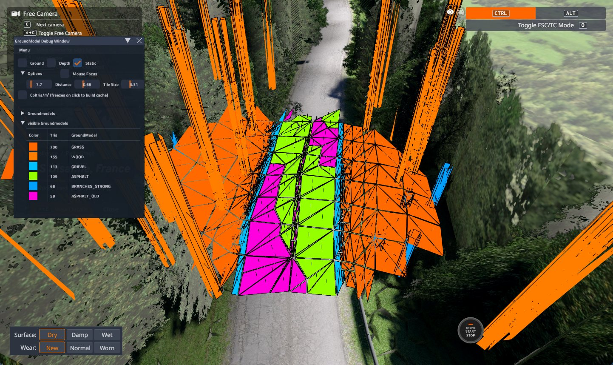
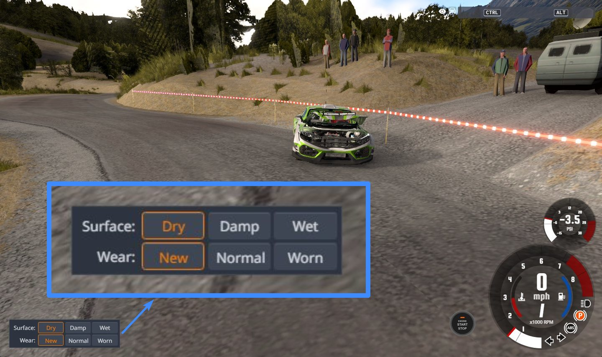
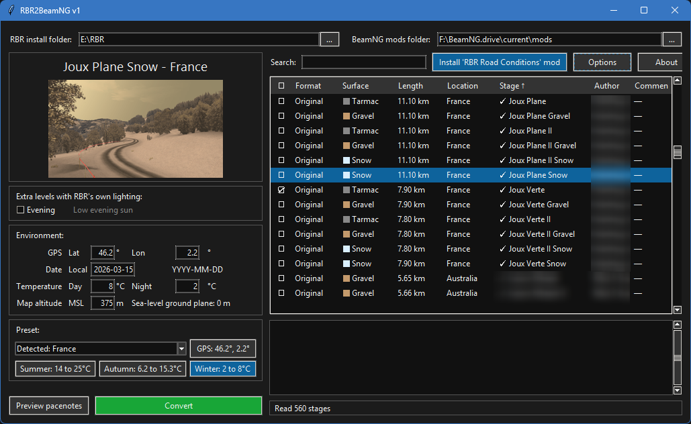
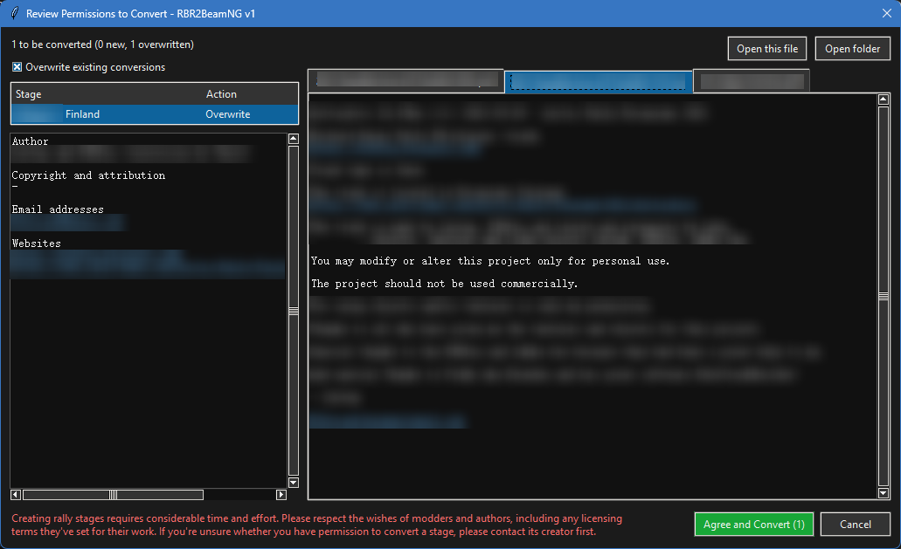
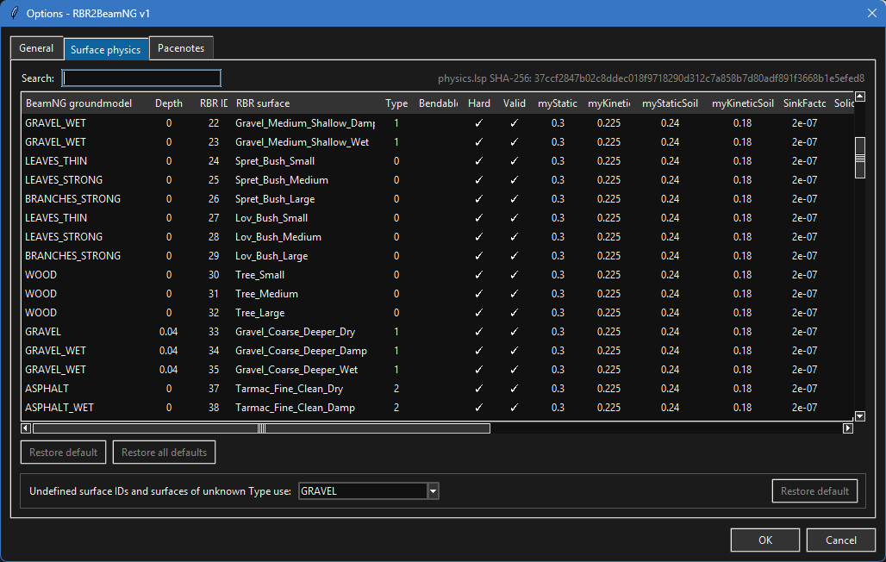
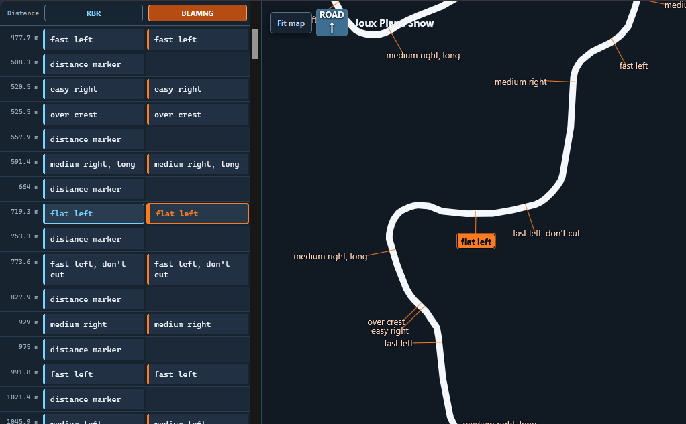

# RBR2BeamNG

**Converts stages from Richard Burns Rally** directly **into BeamNG.drive mods**.

It supports both RX and original RBR formats, as well as both plugin and original pacenote formats.

Some issues are to be expected, so both bug reports and fixes are welcome.

*Transparency note: creating this free open-source converter has required countless hours of work. It is being developed with substantial assistance from AI tools, without which this project would not have happened.*

> [!IMPORTANT]
> Creating rally stages requires considerable time and effort. Please respect the wishes of modders and authors, including any licensing terms they've set for their work. If you're unsure whether you have permission to convert a stage, please contact its creator first.
>
> To help with this, the software will try to identify and display licensing details and creator contact information for each stage.

<p align="center">
  <a href="ingame1.jpg"></a>
  <a href="ingame2.jpg"></a>
  <a href="ingame3.jpg"></a>
</p>

## How to convert a stage with GUI (using prebuilt binaries)

 1. Go to [Releases](https://github.com/askynet1997/rbr2beamng/releases) > and grab the latest `windows_x64` ZIP file.
 2. Extract the ZIP > browse into `rbr2beamng` > run `rbr2beamng.exe`
 3. If the RBR/BeamNG folders were detected correctly, double click any stage.

<p align="center">
  <a href="main.png"></a>
  <a href="permissions.png"></a>
  <br>
  <a href="options.png"></a>
  <a href="pacenotes_preview.png"></a>
</p>

## How to convert a stage with GUI (without prebuilt binaries)

 1. Install [uv](https://docs.astral.sh/uv/getting-started/installation/)
 2. Download or clone this repository, open a terminal and `cd rbr2beamng` inside.
 3. Install dependencies:
```sh
uv sync --locked
uv run --locked packaging/prepare_texconv.py
```
 4. Open the converter:
```sh
uv run --locked -m rbr2beamng.gui
```
 5. If the RBR/BeamNG folders were detected correctly, double click any stage.

## How to convert a stage with CLI

Power users can run the tool from command line:
 - Windows: `rbr2beamng-cli.exe --help`
 - Any OS: `uv run --locked rbr2beamng-cli --help`

## Development

To contribute or customize this tool:

 1. Download development dependencies:
```sh
uv sync --extra dev --locked
uv run --locked packaging/prepare_texconv.py
```
 2. Make any changes you want.
 3. Optionally, build the final windows binaries into `dist/`:
```sh
build.bat
```
